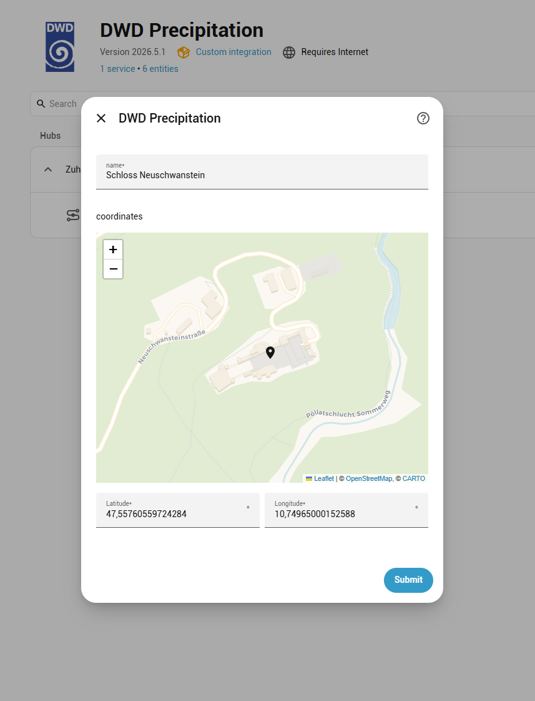
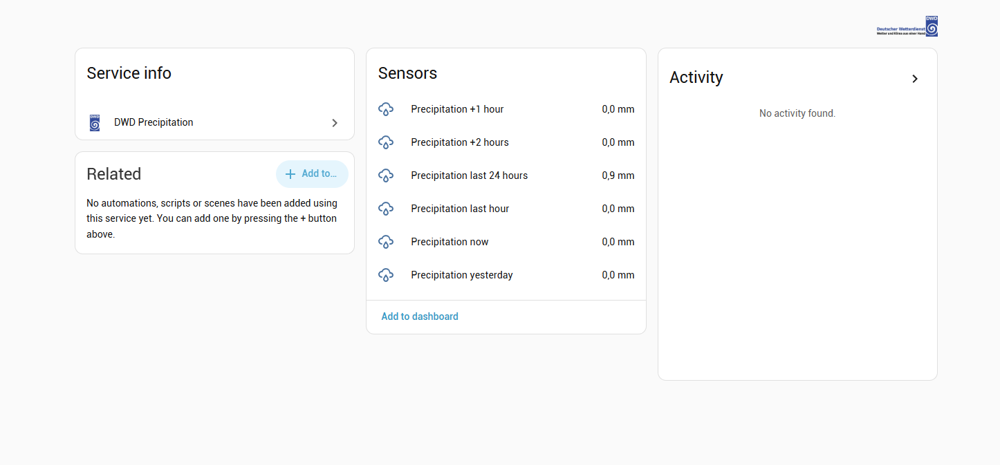

# DWD Precipitation

Radar-based precipitation forecasts and data from the German Weather Service (DWD).

Real-time location based precipitation analysis, forecasts, and historical accumulations — directly in Home Assistant.

## Features

- 5-minute precipitation nowcast and 1-hour / 2-hour radar forecasts from **RADVOR RS**
- High-resolution **RADVOR RV** nowcast: 1-hour / 2-hour totals (to compare against RS), peak-intensity forecasts (mm/h), *precipitation start*/*end* timing sensors, and a *rain expected* binary sensor — all derived from the 5-minute forecast series
- Hourly and 24-hour precipitation accumulations from **RADOLAN RW/SF** (radar + weather station blend)
- Yesterday's 24-hour total updated once daily — ideal for irrigation or energy automations
- Per-location extraction: the nearest radar grid cell to your exact latitude/longitude
- Staleness guard: sensors can report `unavailable` when DWD data is stale, preventing automations from acting on outdated values
- Precise, quantitative analyses and predictions with high temporal and spatial resolution, enabling accurate tracking of rain events at your exact location.
- Ideal data source for automations and early warnings of severe precipitation.

## Screenshots

  

## Limitations

> [!IMPORTANT]
> This integration only works for locations **within Germany** and areas immediately adjacent to the German border. The DWD radar composites do not cover other countries.

## Installation
### Install using HACS (recommended)
If you do not have HACS installed yet visit https://hacs.xyz for installation instructions.

To add the this repository to HACS in your Home Assistant instance, use this Button:

After installation, please restart Home Assistant. To add Power Insight to your Home Assistant instance, use this Button:

Manual configuration steps

### Semi-Manual Installation with HACS
1. Go HACS integrations section.
2. Click on the 3 dots in the top right corner.
3. Select "Custom repositories"
4. Add the URL (https://github.com/hoffmann77/ha-dwd-precipitation) to the repository.
5. Select the integration category.
6. Click the "ADD" button.
7. Now you are able to download the integration

### Manual Installation
1. Access the GitHub repository for this integration.
2. Download the ZIP file of the repository and extract its contents.
3. Copy the "dwd_precipitation" folder into the custom_components directory located typically at /config/custom_components/ in your Home Assistant directory.

### Restart Home Assistant
1. Restart your Home Assistant.

### Add Integration
1. Navigate to Settings > Devices & Services.
2. Click Add Integration and search for "DWD Precipitation".
3. Select the DWD Precipitation integration to initiate setup.

## Configuration

### Setup

When adding the integration, you are prompted for:

| Field | Description |
|-------|-------------|
| **Name** | A label for this integration instance (defaults to your HA location name) |
| **Location** | Latitude/longitude map picker — defaults to your HA home location |

### Options

After setup, open the integration's **Configure** dialog (**Settings > Devices & Services > DWD Precipitation > Configure**) to adjust:

| Option | Default | Description |
|--------|---------|-------------|
| Enable diagnostic state attributes | Off | Adds per-sensor metadata attributes (see below) |
| Mark sensors unavailable when data is stale | On | Sensors become `unavailable` once cached data exceeds the product's release interval; prevents automations from acting on stale values |
| Rain detection threshold (mm per hour) | 0.0 | An RV forecast intensity above this value counts as precipitation for the `start`/`end` and `rain expected` sensors. `0.0` means any DWD-detected rain; raise it to ignore drizzle/noise |
| Precipitation start/end sensor state | Absolute time | Whether the `Precipitation start`/`end` sensors report the absolute time (device class *timestamp*) or the minutes until the event (device class *duration*). The unused representation is exposed as an attribute |

When diagnostic state attributes are enabled, each sensor exposes:

| Attribute | Description |
|-----------|-------------|
| `source_product` | DWD internal product identifier read from the file header (e.g. `"RADVOR-RS"`, `"RW"`) |
| `source_timestamp` | UTC ISO-8601 reference time of the DWD product — for RADVOR forecasts this is the analysis time before the lead offset; for RADOLAN products it is the end of the measurement window |
| `lead_time_minutes` | Forecast lead time in minutes (`0` for the nowcast, `60` or `120` for RADVOR forecasts, `null` for RADOLAN products which have no lead time) |
| `data_start` | ISO-8601 UTC start of the accumulation window (e.g. T−60 min for "last hour"); `null` for products without an accumulation window |
| `data_end` | ISO-8601 UTC end of the accumulation window; for RADOLAN products this equals `source_timestamp` |
| `forecast_5min` | RV hourly-bucket and max-intensity sensors only: the 12 constituent 5-minute forecast points (`lead`, `start`, `end`, `value` in mm, `intensity` in mm/h) making up the hour. Excluded from recorder history |

## Entities

All sensors belong to a single **DWD Precipitation** device per configured location.

| Entity | Data source | Unit | Update interval | Description |
|--------|-------------|------|-----------------|-------------|
| `Precipitation now` | RADVOR RS | mm | 5 min | Calibrated radar analysis for the current 5-minute window |
| `Precipitation +1 hour` | RADVOR RS | mm | 5 min | Calibrated radar forecast for the next 0–60 minutes |
| `Precipitation +2 hours` | RADVOR RS | mm | 5 min | Calibrated radar forecast for the 60–120 minute window |
| `Precipitation +1 hour (RV)` | RADVOR RV | mm | 5 min | RV nowcast total for the next 0–60 minutes (sum of the 5-minute forecasts); provided to compare against the RS `+1 hour` sensor |
| `Precipitation +2 hours (RV)` | RADVOR RV | mm | 5 min | RV nowcast total for the 60–120 minute window; compare against the RS `+2 hours` sensor |
| `Max precipitation intensity +1 hour (RV)` | RADVOR RV | mm/h | 5 min | Peak rain intensity in the next 0–60 minutes — the wettest 5-minute step extrapolated to an hourly rate. Per-step intensities are in the `forecast_5min` attribute |
| `Max precipitation intensity +2 hours (RV)` | RADVOR RV | mm/h | 5 min | Peak rain intensity in the 60–120 minute window |
| `Precipitation start` | RADVOR RV | timestamp / min | 5 min | When precipitation begins at the location (`0` / now if already raining, `unknown` if none within 2 h). Reports the absolute time or the minutes-until value per the *start/end sensor state* option; the other form is the `minutes_until` / `at` attribute |
| `Precipitation end` | RADVOR RV | timestamp / min | 5 min | When the current/next precipitation episode ends (`unknown` if it continues beyond the 2 h horizon). Same representation option as `Precipitation start` |
| `Rain expected next 2 hours` | RADVOR RV | on / off | 5 min | `on` when precipitation is forecast within the next 2 hours. Exposes the forecast start time as `minutes_until` / `at` attributes so an automation can trigger on it and read the start time directly |
| `Precipitation last hour` | RADOLAN RW | mm | 1 h | Radar + station-blended analysis for the past hour |
| `Precipitation last 24 hours` | RADOLAN SF | mm | 1 h | Radar + station-blended total for the rolling past 24 hours |
| `Precipitation yesterday` | RADOLAN SF | mm | Daily (~00:18 UTC+1) | Previous calendar day's 24-hour accumulated total |

## Troubleshooting

**Sensors show `unavailable` immediately after setup** — the integration fetches data on startup; if DWD OpenData is temporarily unreachable the first refresh fails. Check your HA logs for HTTP errors and verify that `opendata.dwd.de` is reachable from your network.

**Sensors always show `unavailable`** — confirm that your configured coordinates are within Germany. Coordinates outside the radar composite coverage area produce a `NaN` from the grid lookup, which surfaces as `unavailable`.

**`extra_state_attributes` are not appearing** — enable the option in **Settings > Devices & Services > DWD Precipitation > Configure**.

**Old values persist after a DWD outage** — if *Mark sensors unavailable when data is stale* is disabled, the last cached value is kept indefinitely. Enable the option so that sensors go `unavailable` once the staleness window expires.

## Data source

All data is derived from the **DWD (Deutscher Wetterdienst)**:

## License

This integration is only possible thanks to the great work done by the contributors of the **[wradlib](https://github.com/wradlib/wradlib)** package.

All files in `custom_components/dwd_precipitation/radar/` are licensed under the [wradlib license](custom_components/dwd_precipitation/radar/LICENSE.txt) (MIT).

A copy of the license can be found under `radar/LICENSE.txt`.
